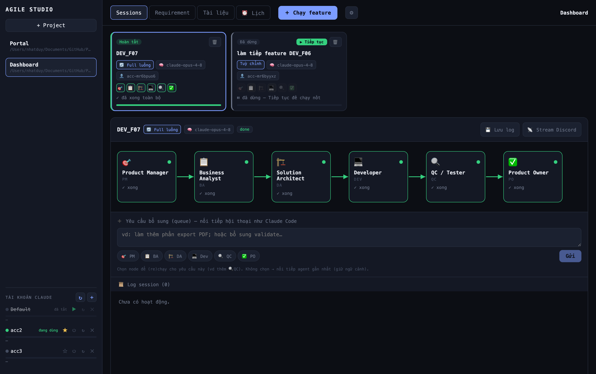
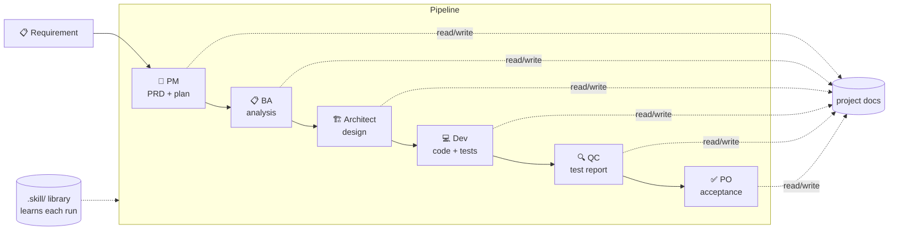
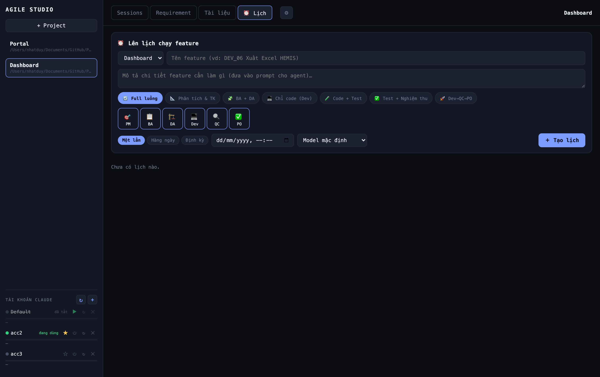
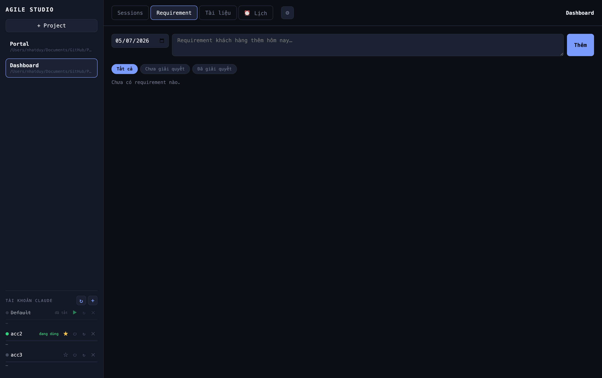

<div align="center">

# 🎯 Agile Studio

### Run an entire Agile/Scrum software team on **Claude Code** — orchestrated from a web dashboard and controlled from your phone via Discord.

**PM → BA → Solution Architect → Dev → QC → PO** — six AI role‑agents that plan, design, build, test and sign‑off a feature. In parallel. On your own repos. With your own Claude subscription.

[](https://nodejs.org)
[](https://www.anthropic.com)
[](#license)
[](#contributing)

</div>

> [!NOTE]
> Agile Studio is an **orchestrator for the official [Claude Code](https://www.anthropic.com) CLI**. It is not affiliated with Anthropic. It spawns headless `claude` processes using **your** logged‑in accounts — no API keys, no token copying.

<p align="center">
  
</p>

---

## ✨ Why Agile Studio?

Claude Code is amazing at *one* task in *one* terminal. Real software work is a **pipeline** with different hats — someone writes the PRD, someone analyses requirements, someone designs, someone codes, someone tests, someone accepts.

Agile Studio turns that pipeline into a visual, controllable machine:

- 🧑‍💻 **6 role‑agents, one feature** — each role reads the previous role's docs and produces its own, following a standard doc structure distilled from a real project.
- 🖥️ **n8n‑style dashboard** — watch every node work in real time (reading/writing files, running builds), run **many features in parallel** like multiple Claude Code tabs.
- 🔴 **Live mode (just like Claude Code in VS Code)** — type a follow‑up while an agent is *still working* and it's injected into the same conversation, full context preserved.
- 👥 **Multi‑account with auto‑switch** — add several Claude accounts, and when one hits its 5‑hour quota the run **hops to another account mid‑flow** and keeps going (conversation restored).
- 🤖 **Discord bot** — start features, queue instructions, pause/resume, switch accounts, schedule runs and get **push notifications** — all from your phone.
- ⏰ **Scheduling** — run a feature once at a time, every day, or on an interval.
- 💰 **Cost & time tracking**, ♻️ **token‑saving economy mode**, 💾 **persistent sessions** that survive restarts.

---

## 🧩 How it works



- Each **node = one headless `claude` process** (`claude -p`) running in your repo, with a role‑specific prompt injected from the shared **skill library** (`.skill/`).
- Roles hand off through **markdown docs on disk** (PRD, analysis, architecture, feature specs, checklists, QC reports, acceptance records) — so context survives even across process/account switches.
- Pick a **mode** (`full`, `refine`, `build`, `devtest`, `harden`, …) or toggle **individual nodes** — e.g. "just Dev + QC for this one".

---

## 📸 A look inside

<table>
  <tr>
    <td width="50%" valign="top">
      
      <p align="center"><b>Sessions</b> — parallel runs, the 6-node pipeline, queue follow-ups & live log.</p>
    </td>
    <td width="50%" valign="top">
      
      <p align="center"><b>Docs</b> — the shareable <code>.skill/</code> library + each project's generated docs.</p>
    </td>
  </tr>
  <tr>
    <td width="50%" valign="top">
      
      <p align="center"><b>Schedule</b> — run a feature once, daily, or on an interval.</p>
    </td>
    <td width="50%" valign="top">
      
      <p align="center"><b>Requirements</b> — capture customer asks, then one-click <i>Analyze → feature</i>.</p>
    </td>
  </tr>
</table>

---

## 🚀 Quick start

**Prerequisites**
- **Node 18+**
- **[Claude Code](https://www.anthropic.com) CLI** in your `PATH` (`claude --version`), logged in (`claude` → `/login`).
- A Claude **Pro/Max** subscription (uses your normal login — no API key).

```bash
git clone https://github.com/<your-username>/agile-studio.git
cd agile-studio
npm install

npm run dev        # backend :4311 + web :5311 (+ Discord bot if configured)
# open http://localhost:5311
```

> `npm run dev:web` runs only the dashboard (no Discord bot).

**First run**
1. **+ Project** → pick the repo folder (native folder picker on macOS/Windows/Linux).
2. **＋ Run feature** → give it a **title + description**, choose a **mode/nodes**, hit run.
3. Watch the nodes light up. Click a node or open **Log session** to see exactly what it's doing.

---

## 🤖 Discord bot (optional but delightful)

Control everything from your phone — no port‑forwarding needed (the bot dials *out* to Discord).

1. Create a bot at the **[Discord Developer Portal](https://discord.com/developers/applications)** → enable **Message Content Intent** → invite it to your server.
2. Create **`bot.config.json`** in the project (git‑ignored):
   ```json
   {
     "discordToken": "YOUR_BOT_TOKEN",
     "channelId": "NOTIFICATION_CHANNEL_ID",
     "mentionUserId": "YOUR_USER_ID_FOR_@PINGS",
     "api": "http://localhost:4311",
     "prefix": "!"
   }
   ```
3. `npm run dev` (or `npm run bot`).

**Slash commands** (with autocomplete): `/run` · `/sessions` · `/detail` · `/queue` · `/resume` · `/pause` · `/schedule` · `/accounts` …
**Buttons & modals**: tap **▶ Run feature** on a project, fill in a form, and a session starts. Every notification carries **⏸ Pause / ▶ Resume / 🗑 Delete** buttons. Turn on **📡 stream log** to pipe a session's live activity into its **own Discord thread** (so sessions never mix).

See [`BOT.md`](BOT.md) for the full command reference.

---

## 🔥 Feature tour

| Area | Highlights |
|------|-----------|
| **Sessions** | Parallel runs · live activity per node · queue follow‑ups · pause (kills the whole process tree) · resume · persistent across restarts |
| **Live mode** | `--input-format stream-json` keeps one process alive so you can inject messages mid‑run; auto‑switches account on rate‑limit and **restores the conversation** on the new account |
| **Accounts** | Add via in‑app OAuth login (paste the code) · enable/disable · set default (⭐) · live usage % · **auto re‑login** when a token expires |
| **Requirements** | Add customer requirements + **file uploads**, mark resolved, one‑click **Analyze → auto‑draft a feature** |
| **Skill library** | `.skill/*.md` role playbooks that **learn** after every feature — new projects inherit them |
| **Docs** | Tree view + search + editor for the skill library and each project's generated docs |
| **Scheduling** | Once / daily / interval — from the web **⏰ Schedule** tab or `/schedule` |
| **Saving** | Per‑node **budget cap ($)**, **economy mode** (skip nodes whose docs already exist), **cost & duration** tracking |
| **Notifications** | Desktop, Slack & Discord webhooks + Discord bot @pings on done/error/quota |

---

## ⚙️ Configuration

| What | Where |
|------|-------|
| Projects, sessions, requirements, schedules, settings | `~/.agile-studio/studio.json` (auto‑created) |
| Extra Claude accounts | `~/.agile-studio/accounts.json` + `~/.agile-studio/accounts/<id>/` (created by the in‑app login) |
| Skill library | `<project>/.skill/*.md` (git‑friendly, shareable) |
| Discord bot | `bot.config.json` (git‑ignored) |
| Defaults (model, economy, budget, webhooks, switch threshold) | ⚙ Settings in the UI → `studio.json` |

---

## 🏗️ Architecture

```
web (React + Vite, :5311)  ──HTTP/WebSocket──▶  server (Express + ws, :4311)
                                                 ├─ runner.js   spawn `claude -p` / stream-json, kill process trees
                                                 ├─ accounts.js read usage %, pick/switch account, OAuth login
                                                 ├─ scaffold.js skill library + role prompts + doc workspace
                                                 └─ store.js    JSON persistence (~/.agile-studio)
Discord bot (discord.js)   ──HTTP/WS──▶  same server API
```

Everything is plain Node + a JSON file — no database, no cloud, runs entirely on your machine.

---

## ⚠️ Good to know

- Running 6 agents (× multiple sessions) uses **a lot** of tokens. Auto‑switch **spreads** load across accounts; it doesn't create quota.
- **macOS** stores Claude credentials in the Keychain; **Linux/Windows** in `~/.claude/.credentials.json`. Agile Studio reads each account only from its own config dir (never borrows another account).
- Agents run with `--dangerously-skip-permissions` so Dev/QC can actually build & test (toggle in Settings). Use on repos you trust.
- The UI is currently **Vietnamese**; i18n PRs very welcome. 🙌

---

## 🗺️ Roadmap

- [ ] Auto Git: branch + commit + PR when a feature is done
- [ ] English / i18n UI
- [ ] Per‑role model & permission profiles
- [ ] Daily summary + cost analytics
- [ ] One‑click "requirement → full pipeline"

---

## 🤝 Contributing

Issues and PRs are welcome — bug fixes, i18n, new modes, better docs. Keep changes focused and match the existing style.

## License

MIT — do whatever you like, attribution appreciated. (Add a `LICENSE` file with the MIT text before publishing.)

---

<div align="center">
Built with ❤️ on top of <a href="https://www.anthropic.com">Claude Code</a>. If this saved you time, a ⭐ helps others find it.
</div>
